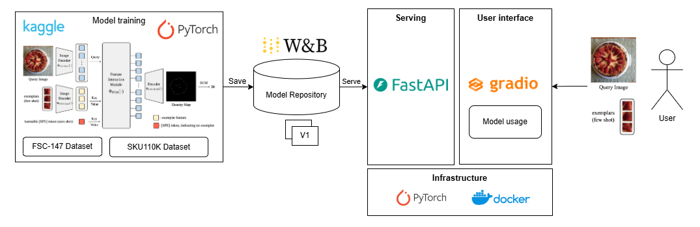

# Few shot object counting

This repo leverage the computer vision model for object counting task in retail. We leverage model name CounTR from [CounTR](https://github.com/Verg-Avesta/CounTR) and fine tuning on subset of SKU110K datasets.

## Dataset

We use subset of SKU110K dataset which is about retail objects. We modified it to fit with object counting problem.

## Deployment

